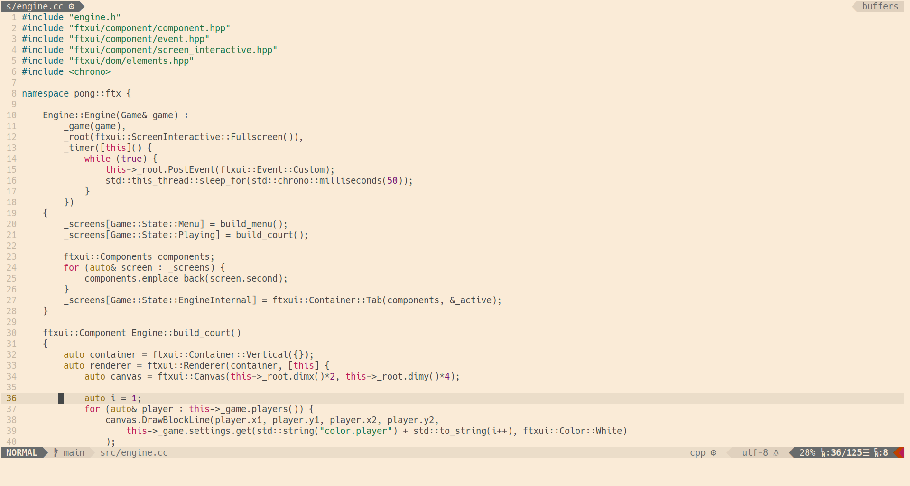
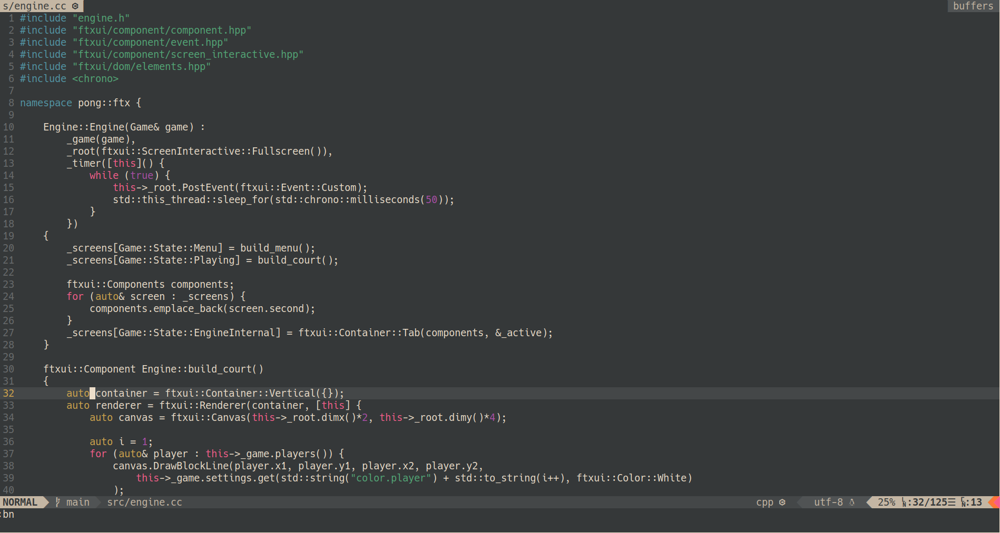

# Screenshots

## light



## dark




ZenGarden is a color scheme for vim/neovim that tries to be
calm and relaxing, while still retaining some important properties
from color theory (contrast, uniform lightness).

It is ... uh ... "heavily influenced" by [gruvbox](https://github.com/morhetz/gruvbox),
by which I mean I took the gruvbox files & simply replaced `gruvbox`
with `zengarden` and changed the colors. Anything that is fancy or
clever in this colorscheme is 100% [morhetz](https://github.com/morhetz)'s work, not mine.

The colors are designed primarily with the light color scheme in mind (contrast), but the dark
version also works (with lighter shades of accents).

# Palette


# Design

:warning: I am a software developer (backend, to boot!), not a designer, and it seriously
shows in this color scheme :P

Since I have 0 creative talent, I attempted to approach the color scheme design scientifically,
by finding out what objective measures are available. Spoiler: I did not find a lot of data.

During my "research" (= searching around in the web), I found a couple of suggestions
that informed me on how to design this color scheme:

* The general consensus *seems* to be that light background is easier on the eye
* Some posts/discussions indicated that blue light *might* be harmful for prolonged exposure,
  for various reasons (one being that it changes the sleep rhythm, and another one that short
  wave lengths possibly penetrate deeper into the eye).
* High contrast - a no-brainer at last! - is important for relaxed reading.

(Note to self: I should prolly come up with references to back up those claims)

So here's the plan I came up with:

* For color selection, use CIE-LCh instead of RGB or HSV, because it emphasizes perceptual
  uniformity. This means that - at least in theory - two colors with the same value for "lightness"
  will be perceived as ... well ... similar in lightness, independent of their hues.
* Use only accent colors that have high contrast (I used [Colour Contrast Tool](https://cliambrown.com/contrast/)).
  Generally, I aimed for a contrast around 70, more for colors on the blue end of the spectrum.
* For blue-ish colors (blue, cyan, also magenta), reduce lightness a bit more. I did this primarily
  because the colors appealed more to me subjectively.
* For lighter/darker colors, the only thing I changed was to increase/decrease the "lightness" value by 10.

# Mode
To specify light or dark mode edit your .vimrc (or nvim's init.vim).

```
set background=light
set background=dark
```
